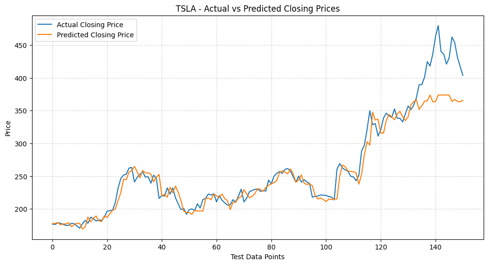

#  Stock Price Prediction - Short-Term (Next Day Closing Price)

This project demonstrates how to use historical stock market data to **predict the next day's closing price** using machine learning models like **Random Forest Regressor**. The project is part of a time series regression task and uses real stock data fetched from **Yahoo Finance** via the `yfinance` API.

##  Objective

Use past stock data (Open, High, Low, and Volume) to predict the **next day's closing price** for a selected stock (e.g., Tesla).

---

##  Dataset

- Source: [Yahoo Finance](https://finance.yahoo.com/)
- Retrieved using the `yfinance` Python library
- Stock Symbol Used: `TSLA` (Tesla Inc.)

### Features Used:
- `Open`
- `High`
- `Low`
- `Volume`

### Target Variable:
- `Close` (next day's closing price)

---

##  Technologies and Skills

-  **Time Series Data Handling**
-  **Regression Modeling** (Random Forest Regressor)
-  **Data Fetching using APIs** (`yfinance`)
-  **Visualization of Predictions**

---

##  Methodology

1. **Fetch Historical Data** using `yfinance`
2. **Preprocess the Data**:
   - Shift the 'Close' column to serve as the next day's target
   - Drop missing values after shifting
3. **Split Data** into training and testing sets
4. **Train the Model**:
   - RandomForestRegressor from `sklearn`
5. **Evaluate and Predict**:
   - Predict the closing prices on test data
6. **Visualize**:
   - Plot actual vs. predicted closing prices

---

##  Results

A line plot shows actual vs predicted closing prices on the test data for `TSLA`. The model follows the trend well, with some deviations in high volatility zones. 

---

